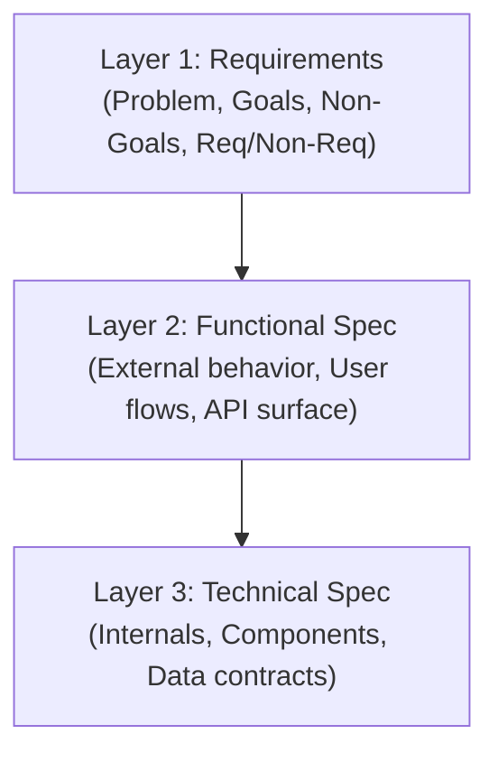

# Architecting Greenfield Projects

This skill guides you through building a new codebase or subsystem from scratch. It prioritizes **clarity of requirements**, **modular contract-first design**, and **retaining the developer's mental model** over fast, unchecked code generation.

---

## Core Philosophy: Architect vs. Builder
1. **The User is the Architect**: You define the vision, goals, and constraints.
2. **The Agent is the Builder**: The agent proposes specifications, scaffolds interfaces, and implements logic.
3. **No "Vibe Coding"**: Never generate code without establishing why it is designed that way. Make all data schemas, interfaces, and contracts explicit before writing any logic.

---

## Development Workflow Checklist

Copy this checklist into your response and update it as you progress:

```markdown
Development Progress:
- [ ] Phase 1: Clarify Requirements & Onion-based Design
  - [ ] Gather initial requirements and context
  - [ ] Write design.md (Onion Layer 1: Requirements)
  - [ ] Write design.md (Onion Layer 2: Functional Spec)
  - [ ] Write design.md (Onion Layer 3: Technical Spec & Contracts)
  - [ ] Halt: Present design to User and obtain buy-in
- [ ] Phase 2: Project Compartmentalization & Scaffolding
  - [ ] Create folder structure and component files
  - [ ] Stub out schemas, interfaces, class/function signatures
  - [ ] Keep components decoupled and stub data contracts
- [ ] Phase 2.5: Project Tour & Scaffold Approval
  - [ ] Present the project structure and contract tour to the User
  - [ ] Halt: Obtain User sign-off on the scaffolding
- [ ] Phase 3: Phased Implementation & Verification
  - [ ] Implement components incrementally (one by one)
  - [ ] Write tests and verify implementation passes contracts
```

---

## Phase 1: Three-Layer Onion Design

Create a `design.md` file in the root of the workspace. The design is structured like a three-layer onion:



### Layer 1: Requirements & Scope
- **Problem Statement**: What problem are we solving?
- **Goals & Non-Goals**: Clear boundaries of what is in and out of scope.
- **Functional Requirements**: What the system *must* do.
- **Non-Functional Requirements**: Performance, security, scalability, constraints.

### Layer 2: Functional Specification (External View)
- Describe precisely how the system behaves from an external perspective.
- Define UI/UX mockups, CLI commands, external API endpoints, and success/error behaviors.
- **Justification**: Explicitly explain how the Functional Spec satisfies all requirements in Layer 1.

### Layer 3: Technical Specification (Internal View)
- Define internal system architecture, data flow diagrams, and database schemas.
- Divide the project into **independent, decoupled parts**.
- Establish data contracts and interface definitions between components.
- **Justification**: Explicitly explain how the Technical Spec implements the Functional Spec.

> [!CAUTION]
> **Halt and Request Review**: You must not write any code until the user approves `design.md`. Present the design clearly, highlight open questions, and ask the user to buy in.

---

## Phase 2: Scaffolding and Contracts

Once the design is approved, create the workspace file structure:
1. **Compartmentalize**: Group code by component. Minimize dependencies between parts.
2. **Schema & Types**: Declare data schemas explicitly in comments, types, or interfaces.
3. **Signatures Only**: Write classes and functions with complete parameter types, return types, and docstrings explaining their responsibility.
4. **No Logic**: Do not write the body of classes/functions. Use stubs:
   ```python
   # Example Python Stub
   def process_transaction(transaction: TransactionSchema) -> TransactionReceipt:
       """
       Processes a transaction and returns a receipt.
       Follows Schema Contract: See docs/schemas/transaction.json
       """
       raise NotImplementedError("Stubbed for project scaffolding review")
   ```

---

## Phase 2.5: The Project Tour

When scaffolding is complete:
1. Provide a directory tree of the workspace.
2. Walk the user through each file: show key interface definitions, schemas in comments, and component contracts.
3. Explain how they connect to fulfill the technical specification.

> [!IMPORTANT]
> **Halt and Request Sign-off**: Do not implement any logic until the user understands and signs off on the scaffolding and contract tour.

---

## Phase 3: Staged Implementation & Verification

After scaffolding sign-off, begin implementing component by component. You should give suggestions to the user for which components to tackle first, but only proceed on the components that the user approves to be implemented:
1. **TDD / Contract Checks**: Write tests that verify compliance with the interface contracts first.
2. **Incremental Execution**: Implement one component at a time. Keep components decoupled by using stubbed/mock data for dependencies not yet implemented.
3. **Developer Growth Dialogue**: Explain *why* you are writing logic in a particular way to ensure the user retains a complete mental model of the codebase.
