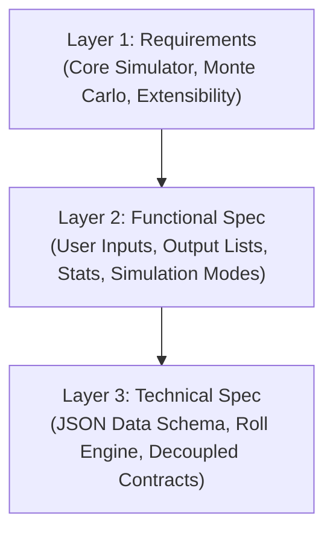

# Pokemon Sleep Encounter Simulation Engine: Three-Layer Onion Design

This document describes the architecture and design of a Monte Carlo simulation engine for sleep encounters in Pokemon Sleep.



---

## Layer 1: Requirements & Scope

### 1.1 Problem Statement
In the mobile game *Pokemon Sleep*, player progress and team optimization depend on encountering and catching specific Pokemon. Encounters are determined by a complex system of mechanics: Snorlax Power, Sleep Score, Sleep Type (Dozing, Snoozing, Slumbering), map/island, and Drowsy Power Requirements (DPR).
Players face meta-strategy questions:
*   Should they split their sleep into two sessions (naps) or focus on a single main session to target a specific Pokemon?
*   Given a set of target Pokemon and catch priorities, which map and sleep type will maximize the probability of encountering them?

To answer these questions, we need a robust, reusable, and mathematically accurate sleep encounter simulation engine that can power Monte Carlo simulations.

### 1.2 Goals
1.  **Parse and Import Data**: Extract a complete, clean JSON database of all 857 Pokemon sleep styles, including their DPR, sleep type, scripted unlock ranks, and map presence from the provided Excel workbook.
2.  **Accurate Sleep Style Roll Engine**: Implement the sequential roll logic of Pokemon Sleep:
    *   Compute spawn counts (3 to 8) based on Drowsy Power and map.
    *   Filter the eligible pool by map, sleep type, Snorlax rank, and DPR.
    *   Subtract rolled style DPR from the Drowsy Power gauge.
    *   Enforce a maximum of 1 Atop-Belly (4-star) style per session.
    *   Incorporate special rules for the **last roll** (deterministic highest style <= remaining gauge).
    *   Incorporate **depleted gauge rules (v2.11.0+)** using a special no-gauge roll pool of up to 10 styles <= current Snorlax rank.
3.  **Monte Carlo Simulator**: Run multiple iterations (e.g. 10,000 nights) to calculate encounter probabilities and expected values.
4.  **Meta-Strategy Analytics**: Build helper routines to answer the sleep-split optimization and map selection questions.
5.  **Rich Visual UI**: Create an interactive web-based dashboard (use the same framework as the existing pokesleep-tool) to configure, run, and visualize the simulations. Our additions should use the existing patterns in the repo, and the UI should also be in the same component-based style, with all the components in the same folder. Unless there are anti-patterns in the existing repo - in which case, we should halt and determine whether to refactor or conform with the existing patterns.

### 1.3 Non-Goals
*   Simulating the movement/noise sensor sleep type detection (the sleep style type is an input).
*   Balanced Sleep Type (since it uses complex, unconfirmed rules, we will restrict rolls to Dozing, Snoozing, and Slumbering for now).
*   Good Camp Ticket and Incense modifiers (can be stubbed out and ignored for the base gauge rolls).
*   The meta-questions mentioned in the problem statements can be ignored for now - however, they should be kept in mind for determining our data contracts.

### 1.4 Requirements Justification
*   **Decoupled Engine**: The core engine must be completely independent of the UI. This ensures it can be run in CLI scripts, tests, or web worker threads to run large Monte Carlo workloads without freezing the UI.

---

## Layer 2: Functional Specification (External View)

The system will expose two modes of operation to the user: **Single-Night Simulation** and **Monte Carlo Strategy Analyzer**.

### 2.1 Single-Night Simulation UI
The user inputs:
1.  **Map**: Select one of the 8 islands (Greengrass Isle, Cyan Beach, Taupe Hollow, Snowdrop Tundra, Lapis Lakeside, Old Gold Power Plant, Amber Canyon, Greengrass Isle Expert).
2.  **Snorlax Power**: Raw power value (e.g., 500,000) or Snorlax Rank (e.g. Master 3).
3.  **Sleep Score**: 1 to 100.
4.  **Sleep Style**: Dozing, Snoozing, or Slumbering.
5.  **Roll Weighting Model**: Choice between:
    *   *Flat*: All eligible styles have equal weight. (implement this only but make it extensible so we could add more roll weighting models in the future)
    *   *Inverse DPR* ($1/dpr$): Rare styles with higher DPR have lower weights. (out of scope)
    *   *Inverse Square Root DPR* ($1/\sqrt{dpr}$): Curated balance of probability. (out of scope)

**Outputs Displayed**:
*   Calculated Drowsy Power (Snorlax Power * Sleep Score).
*   Calculated Spawn Count.
*   The sequential rolls timeline:
    *   Roll 1: Pokemon name, star rating, DPR, remaining gauge.
    *   Roll 2: ...
    *   *Depletion warning* if the gauge was depleted.
    * For each roll we should mention what rule was used, e.g. "Rolled 312th style out of 435 eligble styles" for normal rolls, "Rolled 1st style out of 2 eligible styles" for last roll, and "Rolled 1st style out of 10 eligible styles (depleted gauge roll)" for depleted gauge rolls.

### 2.2 Monte Carlo Strategy Analyzer UI
The user defines:
1.  **Target List**: A list of Pokemon they want to catch (all star ratings are eligible).
2.  **Catch Priority**: 1 - 5.
3.  **Analysis Mode**:
    *   *Sleep Split Optimizer*: Simulates split sleep sessions (e.g. Session 1 score $S_1$, Session 2 score $100-S_1$) to maximize the total expected catch value for the target Pokemon. 
    *   *Map & Sleep Style Selector*: Computes expected target encounters across all 8 maps and 3 sleep types to find the best combination. (User will need to input the rank of the Snorlax they are aiming for)

**Outputs Displayed**:
*   For the Map & Sleep Style Selector mode, a table with the following columns:
    * Map Name
    * Sleep Style
    * Expected Target Pokemon Count
    * Expected Total Catch Value
    * Example roll for reference
*   For the Sleep Split Optimizer mode, a table with the following columns:
    * Sleep Split (e.g. 70 / 30 main sleep/nap split)
    * Expected Target Pokemon Count
    * Expected Total Catch Value

---

## Layer 3: Technical Specification (Internal View)

### 3.1 Data Schema
The compiled sleep style database is stored in `src/data/sleepStyles.json` in the following format:
```json
[
  {
    "pokemon": "Bulbasaur",
    "style": 1,
    "dpr": 418000,
    "sleepType": "dozing",
    "unlockRank": "B2",
    "areas": [0, 7, 4]
  }
]
```

### 3.2 Core Component Architecture
The simulator is divided into three modules:
1.  **Rank Converter (`src/util/encounter/RankConverter.ts`)**:
    *   Maps rank strings (e.g., `'B2'`, `'G1'`, `'U5'`, `'M20'`) to/from field index Snorlax Powers.
2.  **Encounter Simulator (`src/util/encounter/EncounterEngine.ts`)**:
    *   Calculates spawn counts.
    *   Filters the eligible pool.
    *   Performs standard rolls (updating gauge and atop-belly status).
    *   Applies the last roll and depleted gauge (no-gauge) pool logics.
3.  **Monte Carlo Strategy Engine (`src/util/encounter/MonteCarloEngine.ts`)**:
    *   Loops simulation runs.
    *   Aggregates frequency statistics.
    *   Analyzes split sleep options.

```
+-------------------------------------------------------------+
|                         Main App                            |
|   (Single-Night View, Strategy Analyzer, Parameter Sliders) |
+------------------------------+------------------------------+
                               |
                               v
+-------------------------------------------------------------+
|                 Monte Carlo Strategy Engine                 |
|             (Split Sleep / Optimal Map Solvers)             |
+------------------------------+------------------------------+
                               |
                               v
+-------------------------------------------------------------+
|                      Encounter Engine                       |
|   (Pool Filter, Sequential Rolls, Last Roll, Empty Gauge)   |
+------------------------------+------------------------------+
                               |
                               +---> RankConverter
                               +---> sleepStyles.json
```

### 3.3 Core Code Interfaces

```typescript
export type SleepType = "dozing" | "snoozing" | "slumbering";

export interface SleepStyle {
  pokemon: string;
  style: number;      // 1, 2, 3, 4, 5
  dpr: number;
  sleepType: SleepType;
  unlockRank: string; // e.g. "B2", "G1"
  areas: number[];    // list of fieldIndices
}

export interface SimulationConfig {
  fieldIndex: number;
  sleepType: SleepType;
  snorlaxPower: number;
  sleepScore: number;
  weightModel: "flat" | "inverse" | "inverseSqrt";
}

export interface RollStep {
  rollIndex: number;
  rolledStyle: SleepStyle;
  dprConsumed: number;
  remainingGauge: number;
  isNoGaugeRoll: boolean;
}

export interface SimulationResult {
  drowsyPower: number;
  spawnCount: number;
  rolls: RollStep[];
  gaugeDepleted: boolean;
}
```

### 3.4 Rolling Algorithm Details

For a given `SimulationConfig`, the engine computes `drowsyPower = snorlaxPower * sleepScore` and `spawnCount`.
It resolves the player's Snorlax rank from `snorlaxPower` on the given map.

1.  **Pre-grouped Index (Initialization)**:
    At startup, the engine indexes the flat `sleepStyles.json` list into a nested lookup tree:
    `MapIndex (0-7) -> SleepType (dozing/snoozing/slumbering) -> Sorted Array of SleepStyles (sorted by DPR ascending)`.
    This reduces the search space for any night's simulation to a pre-filtered sub-array of about 30–80 styles.

2.  **Form the Eligible Pool (Per-Simulation Night)**:
    Retrieve the sub-array for the specific `fieldIndex` and `sleepType` from the pre-grouped index in $O(1)$.
    Filter this sub-array by:
    *   `style.dpr <= drowsyPower` (must be higher than its DPR from start)
    *   `getPowerForRank(fieldIndex, style.unlockRank) <= snorlaxPower`
    This final pool of eligible styles is computed once per night simulation and used for all rolls.

### 3.5 Sequential Rolls Loop

Maintain `remainingGauge = drowsyPower`, `hasAtopBelly = false`, `rolledList = []`.
For `roll = 1` to `spawnCount`:
*   **Case A: Remaining gauge is not depleted** (i.e., at least one eligible style has `dpr <= remainingGauge` and respects atop-belly limits).
    *   **Subcase A1: It is the last roll (`roll === spawnCount`)**:
        *   Determine the pool of eligible styles:
            *   Must have `dpr <= remainingGauge`.
            *   Must **exclude all 3-star sleep styles** (which are the "Rarer Spawns" forbidden on the last roll).
            *   Must **exclude all 4-star sleep styles if `hasAtopBelly === true`** (otherwise, 4-star styles are eligible).
        *   Apply the 20/80 pool rule: 20% chance of using the full eligible pool, 80% chance of using a smaller pool. (For simulation, the smaller pool can filter out higher-tier or higher-DPR styles).
        *   Deterministic Selection: Select the style with the *highest* DPR <= `remainingGauge` in the chosen pool.
        *   Tiebreaker: Pick the style with the lowest unlock rank. If still tied, pick the style with the lowest internal ID (we sort by dex number/pokemon name).
        *   Annotation: `"Rolled style X out of Y eligible styles (last roll rule)"`
    *   **Subcase A2: It is a non-last roll**:
        *   Filter the eligible pool to styles with `dpr <= remainingGauge`.
        *   If `hasAtopBelly === true`, filter out all 4-star styles.
        *   Select one style randomly using flat/equal probabilities.
        *   Subtract its DPR from `remainingGauge`.
        *   If it is a 4-star style, set `hasAtopBelly = true`.
        *   Annotation: `"Rolled style X out of Y eligible styles (normal roll rule)"`
*   **Case B: Remaining gauge is depleted** (no eligible style has `dpr <= remainingGauge` or respects atop-belly):
    *   Apply v2.11.0+ depleted gauge rules:
        *   Form a no-gauge pool of all eligible styles whose unlock rank is <= current Snorlax rank.
        *   If `hasAtopBelly === true`, filter out all 4-star styles from this pool.
        *   Select randomly (with standard weights) from this no-gauge pool up to 10 styles, ignoring gauge deduction.
        *   Annotation: `"Rolled style X out of Y eligible styles (depleted gauge roll)"`


### 3.6 Technical Spec Justification
*   **Performance**: Since Monte Carlo runs can do 100,000 iterations, the roll loops must not do any DOM queries or use React state. The simulation is structured as a pure Javascript function.
*   **Extensibility**: Adding new maps or new Pokemon only requires rebuilding `sleepStyles.json` or appending to it. The simulation engine code remains unchanged.
*   **Performance Instrumentation (Profiling)**:
    To measure and guarantee execution speed, `MonteCarloEngine.ts` will support an optional `profile` execution mode. When enabled, it records:
    1.  `poolFilterTime`: Time spent on retrieving from pre-grouped index and filtering Snorlax Rank / DPR.
    2.  `rollLoopTime`: Time spent executing sequential rolls.
    3.  `aggregationTime`: Time spent compiling target probabilities and statistics.
    These metrics will be printed to the developer console or UI to pinpoint bottlenecks (e.g. if array allocations or RNG selections are taking too much time).

